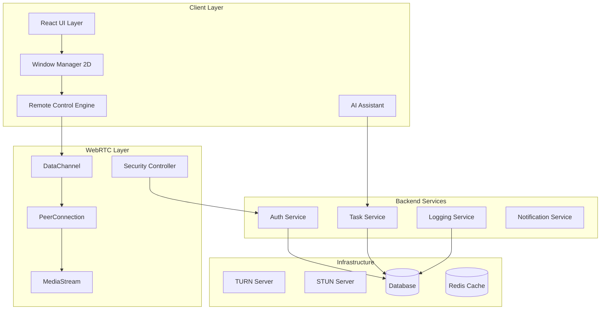

# Interactive WebRTC Workspace - Design Document

## Overview

Interactive WebRTC Workspaceは、従来の画面共有を超えた次世代のリモートワークスペースソリューションです。WebRTC技術をベースに、リアルタイム操作転送、エンタープライズグレードのセキュリティ、AI支援による最適化を統合し、業務効率化に特化したユニークなUXを提供します。

## Architecture

### High-Level Architecture



### Component Architecture

#### 1. Remote Control Engine
```typescript
interface RemoteControlEngine {
  // イベント送信
  sendMouseEvent(event: MouseEvent): Promise<void>;
  sendKeyboardEvent(event: KeyboardEvent): Promise<void>;
  sendScrollEvent(event: WheelEvent): Promise<void>;
  
  // セキュリティ
  encryptEvent(event: InputEvent): EncryptedEvent;
  validatePermission(action: string): boolean;
  
  // 品質制御
  adjustQuality(networkCondition: NetworkCondition): void;
  optimizeLatency(): void;
}
```

#### 2. Security Controller
```typescript
interface SecurityController {
  // 認証・認可
  authenticateUser(credentials: UserCredentials): Promise<AuthToken>;
  validateSession(token: AuthToken): Promise<boolean>;
  checkPermission(user: User, resource: Resource): boolean;
  
  // 暗号化
  encryptData(data: any): EncryptedData;
  decryptData(encryptedData: EncryptedData): any;
  
  // 監査ログ
  logActivity(activity: UserActivity): void;
  detectAnomalousActivity(activities: UserActivity[]): SecurityAlert[];
}
```

#### 3. AI Assistant
```typescript
interface AIAssistant {
  // レイアウト最適化
  suggestOptimalLayout(workPattern: WorkPattern): LayoutSuggestion;
  learnUserBehavior(activities: UserActivity[]): UserProfile;
  
  // 情報抽出
  extractImportantInfo(screenContent: ScreenContent): ImportantInfo[];
  detectTaskCompletion(activities: UserActivity[]): TaskStatus;
  
  // 予測・提案
  predictNextAction(context: WorkContext): ActionSuggestion[];
  suggestBreak(workSession: WorkSession): BreakSuggestion;
}
```

## Components and Interfaces

### 1. Enhanced Window Manager

```typescript
interface EnhancedWindowManager extends WindowManager2D {
  // リモート操作
  enableRemoteControl(windowId: string): Promise<void>;
  disableRemoteControl(windowId: string): void;
  
  // グループ管理
  createWindowGroup(windows: WindowId[], groupName: string): WindowGroup;
  moveToGroup(windowId: string, groupId: string): void;
  
  // 俯瞰ビュー
  enterOverviewMode(): void;
  exitOverviewMode(): void;
  
  // AI統合
  applyAISuggestion(suggestion: LayoutSuggestion): void;
  enableAutoOptimization(enabled: boolean): void;
}
```

### 2. Task Integration Service

```typescript
interface TaskIntegrationService {
  // タスク連動
  linkWindowToTask(windowId: string, taskId: string): void;
  getTaskWindows(taskId: string): WindowId[];
  
  // ワークフロー
  createWorkflow(tasks: Task[]): Workflow;
  executeWorkflow(workflowId: string): Promise<WorkflowResult>;
  
  // 進捗追跡
  trackProgress(taskId: string): TaskProgress;
  generateReport(timeRange: TimeRange): ProgressReport;
}
```

### 3. Collaboration Engine

```typescript
interface CollaborationEngine {
  // リアルタイム共有
  shareWorkspace(workspaceId: string, users: UserId[]): void;
  joinSharedWorkspace(workspaceId: string): Promise<void>;
  
  // 同時編集
  enableCollaborativeEditing(windowId: string): void;
  handleConflictResolution(conflicts: EditConflict[]): Resolution[];
  
  // コミュニケーション
  sendMessage(message: Message, recipients: UserId[]): void;
  startVoiceChat(participants: UserId[]): VoiceSession;
}
```

## Data Models

### Core Models

```typescript
// ワークスペース
interface Workspace {
  id: string;
  name: string;
  owner: UserId;
  windows: WindowConfiguration[];
  layout: LayoutConfiguration;
  permissions: Permission[];
  createdAt: Date;
  updatedAt: Date;
}

// 拡張ウィンドウ設定
interface WindowConfiguration extends MenuItem {
  // リモート操作設定
  remoteControlEnabled: boolean;
  operationPermissions: OperationPermission[];
  
  // セキュリティ設定
  encryptionLevel: EncryptionLevel;
  accessPolicy: AccessPolicy;
  
  // AI設定
  aiOptimizationEnabled: boolean;
  behaviorLearningEnabled: boolean;
  
  // タスク連動
  linkedTasks: TaskId[];
  workflowSteps: WorkflowStep[];
}

// セキュリティモデル
interface SecurityContext {
  user: User;
  session: Session;
  permissions: Permission[];
  encryptionKeys: EncryptionKey[];
  auditLog: AuditEntry[];
}

// AI学習データ
interface UserBehaviorProfile {
  userId: string;
  workPatterns: WorkPattern[];
  preferences: UserPreference[];
  productivityMetrics: ProductivityMetric[];
  optimizationHistory: OptimizationHistory[];
}
```

### Event Models

```typescript
// リモート操作イベント
interface RemoteOperationEvent {
  id: string;
  type: 'mouse' | 'keyboard' | 'scroll' | 'touch';
  windowId: string;
  coordinates?: Point;
  data: any;
  timestamp: Date;
  encrypted: boolean;
}

// セキュリティイベント
interface SecurityEvent {
  id: string;
  type: SecurityEventType;
  severity: 'low' | 'medium' | 'high' | 'critical';
  user: UserId;
  resource: ResourceId;
  details: any;
  timestamp: Date;
}

// AI推論結果
interface AIInsight {
  id: string;
  type: 'layout_optimization' | 'task_prediction' | 'anomaly_detection';
  confidence: number;
  suggestion: any;
  reasoning: string;
  timestamp: Date;
}
```

## Error Handling

### Error Categories

1. **Network Errors**
   - Connection timeout
   - Bandwidth limitation
   - Packet loss

2. **Security Errors**
   - Authentication failure
   - Permission denied
   - Encryption error

3. **Performance Errors**
   - Resource exhaustion
   - Latency threshold exceeded
   - Quality degradation

4. **Business Logic Errors**
   - Invalid operation
   - Workflow violation
   - Data inconsistency

### Error Recovery Strategies

```typescript
interface ErrorRecoveryStrategy {
  // ネットワーク復旧
  handleNetworkError(error: NetworkError): Promise<void>;
  
  // セキュリティ復旧
  handleSecurityError(error: SecurityError): Promise<void>;
  
  // パフォーマンス復旧
  handlePerformanceError(error: PerformanceError): Promise<void>;
  
  // 自動復旧
  enableAutoRecovery(enabled: boolean): void;
  
  // フォールバック
  activateFallbackMode(): void;
}
```

## Testing Strategy

### Unit Testing
- Component isolation testing
- Mock WebRTC connections
- Security function validation
- AI algorithm testing

### Integration Testing
- End-to-end WebRTC communication
- Multi-user collaboration scenarios
- Security policy enforcement
- Performance under load

### Security Testing
- Penetration testing
- Encryption validation
- Authentication bypass attempts
- Data leakage prevention

### Performance Testing
- Latency measurement
- Throughput optimization
- Resource usage monitoring
- Scalability testing

### User Experience Testing
- Usability testing
- Accessibility compliance
- Cross-platform compatibility
- Mobile responsiveness

## Deployment Architecture

### Production Environment

```yaml
# Kubernetes Deployment
apiVersion: apps/v1
kind: Deployment
metadata:
  name: interactive-webrtc-workspace
spec:
  replicas: 3
  selector:
    matchLabels:
      app: webrtc-workspace
  template:
    spec:
      containers:
      - name: frontend
        image: webrtc-workspace-frontend:latest
        ports:
        - containerPort: 3000
      - name: backend
        image: webrtc-workspace-backend:latest
        ports:
        - containerPort: 5000
      - name: turn-server
        image: coturn:latest
        ports:
        - containerPort: 3478
```

### Security Infrastructure

```yaml
# Security Configuration
security:
  encryption:
    algorithm: "AES-256-GCM"
    keyRotation: "24h"
  
  authentication:
    provider: "OAuth2 + OpenID Connect"
    mfa: true
    sessionTimeout: "8h"
  
  compliance:
    gdpr: true
    soc2: true
    auditLogging: true
```

## Performance Optimization

### Client-Side Optimization
- WebAssembly for heavy computations
- Service Worker for offline capability
- IndexedDB for local caching
- WebGL for hardware acceleration

### Server-Side Optimization
- Redis for session management
- CDN for static assets
- Load balancing for scalability
- Database connection pooling

### Network Optimization
- Adaptive bitrate streaming
- Packet loss recovery
- Jitter buffer optimization
- Bandwidth estimation

## Monitoring and Analytics

### Key Metrics
- Latency (target: <100ms)
- Throughput (target: >30fps)
- Error rate (target: <0.1%)
- User satisfaction (target: NPS >70)

### Monitoring Tools
- Real-time performance dashboard
- Security incident tracking
- User behavior analytics
- Resource usage monitoring

## Migration Strategy

### Phase 1: Core Infrastructure
- WebRTC DataChannel implementation
- Basic remote control functionality
- Security framework setup

### Phase 2: Enhanced Features
- AI assistant integration
- Task management system
- Collaboration features

### Phase 3: Enterprise Features
- Advanced security controls
- Compliance reporting
- Mobile applications

### Phase 4: AI Optimization
- Machine learning models
- Predictive analytics
- Automated optimization

This design provides a comprehensive foundation for implementing the Interactive WebRTC Workspace that addresses all the identified challenges while maintaining scalability, security, and user experience excellence.