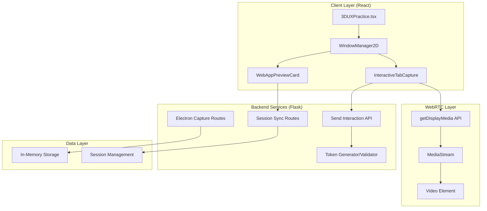
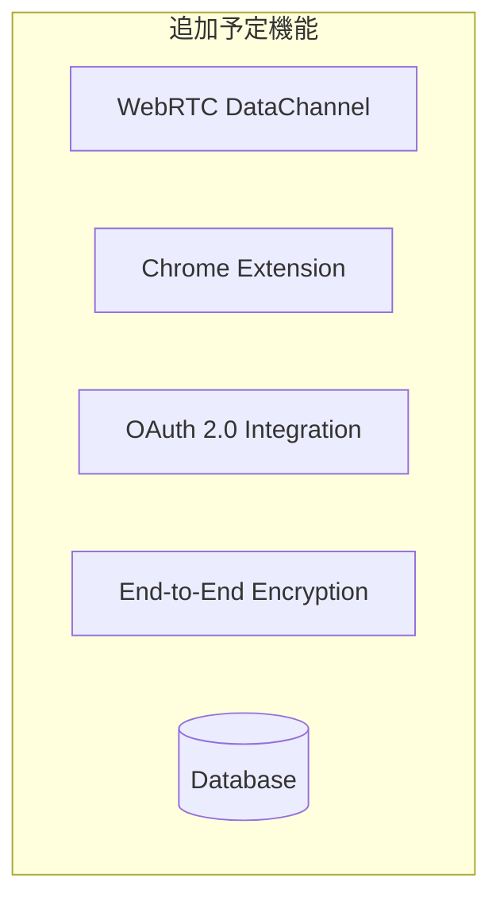

# Interactive WebRTC Workspace - Design Document

## Overview

### プロジェクト背景
Interactive WebRTC Workspaceは、個人開発プロジェクト「MySkillHubs」内のPoC機能の一つです。MySkillHubsは、タスク管理、CRM、AI情報収集、WebRTCウィンドウマネージャーなど、複数の実験的機能を統合したアプリケーションです。

### 本機能の目的
既存の2D WebRTCウィンドウマネージャーを基盤として、リモート操作機能とセキュリティ機能を段階的に追加し、実用的なインタラクティブワークスペースを構築します。現在実装されているタブキャプチャ、Electronキャプチャ、セッション同期機能を活用しながら、段階的に機能を拡張していきます。

### 開発アプローチ
- **Phase 1**: 基本機能の完成（リモート操作実行、セキュリティ強化）
- **Phase 2**: 高度な機能の追加（WebRTC DataChannel、暗号化、OAuth統合）
- **Phase 3**: AI・モバイル対応（将来実装）

## 現在の実装状況

### フロントエンド（React + TypeScript）
- **2Dウィンドウマネージャー**: ドラッグ、リサイズ、カメラ操作（パン、ズーム）
- **WebRTCタブキャプチャ**: getDisplayMedia APIを使用したリアルタイムストリーミング
- **InteractiveTabCapture**: 操作イベント送信の基礎構造（クリック、スクロール）
- **WebAppPreviewCard**: Webアプリプレビューとセッション同期UI

### バックエンド（Flask + Python）
- **Electronキャプチャルート**: `/api/service/3d/start-electron-capture`（モックモード対応）
- **セッション同期ルート**: `/api/sync-session/<app_id>`（Gmail、GitHub、Notion、Slack）
- **操作転送ルート**: `/api/service/3d/send-interaction`（基礎実装）
- **セキュリティ**: HMAC-SHA256トークン生成・検証

## Architecture

### High-Level Architecture（現在の実装）



### Phase 2以降の拡張予定



### Component Architecture

#### 1. Remote Control Engine（現在の実装）

**現在の実装:**
```typescript
// InteractiveTabCapture コンポーネント内
const sendInteraction = async (interaction: any) => {
  if (!interactionEnabled || !sessionToken) return;

  try {
    const response = await fetch('/service/3d/send-interaction', {
      method: 'POST',
      headers: { 'Content-Type': 'application/json' },
      body: JSON.stringify({
        session_id: tabStream.id,
        token: sessionToken,
        ...interaction
      })
    });
  } catch (error) {
    console.error('Interaction error:', error);
  }
};
```

**Phase 2での拡張予定:**
```typescript
interface RemoteControlEngine {
  // イベント送信
  sendMouseEvent(event: MouseEvent): Promise<void>;
  sendKeyboardEvent(event: KeyboardEvent): Promise<void>;
  sendScrollEvent(event: WheelEvent): Promise<void>;
  
  // セキュリティ
  encryptEvent(event: InputEvent): EncryptedEvent;
  validatePermission(action: string): boolean;
  
  // 品質制御
  adjustQuality(networkCondition: NetworkCondition): void;
  optimizeLatency(): void;
}
```

#### 2. Security Controller（現在の実装）

**現在の実装（Python/Flask）:**
```python
def generate_secure_token(user_id: str, session_id: str) -> str:
    """セキュアなトークンを生成（HMAC-SHA256）"""
    timestamp = str(int(datetime.now().timestamp()))
    message = f"{user_id}:{session_id}:{timestamp}"
    signature = hmac.new(
        SECRET_KEY.encode(),
        message.encode(),
        hashlib.sha256
    ).hexdigest()
    return base64.b64encode(f"{message}:{signature}".encode()).decode()

def verify_token(token: str) -> dict:
    """トークンを検証（24時間有効期限）"""
    # トークン検証ロジック
    # 署名検証、有効期限チェック
```

**Phase 2での拡張予定:**
```typescript
interface SecurityController {
  // 認証・認可
  authenticateUser(credentials: UserCredentials): Promise<AuthToken>;
  validateSession(token: AuthToken): Promise<boolean>;
  checkPermission(user: User, resource: Resource): boolean;
  
  // 暗号化（AES-256-GCM）
  encryptData(data: any): EncryptedData;
  decryptData(encryptedData: EncryptedData): any;
  
  // 監査ログ
  logActivity(activity: UserActivity): void;
  detectAnomalousActivity(activities: UserActivity[]): SecurityAlert[];
}
```

#### 3. AI Assistant（Phase 3 - 将来実装）

**現状:** 未実装。Phase 3以降で検討。

**Phase 3での実装予定:**
```typescript
interface AIAssistant {
  // レイアウト最適化
  suggestOptimalLayout(workPattern: WorkPattern): LayoutSuggestion;
  learnUserBehavior(activities: UserActivity[]): UserProfile;
  
  // 情報抽出
  extractImportantInfo(screenContent: ScreenContent): ImportantInfo[];
  detectTaskCompletion(activities: UserActivity[]): TaskStatus;
  
  // 予測・提案
  predictNextAction(context: WorkContext): ActionSuggestion[];
  suggestBreak(workSession: WorkSession): BreakSuggestion;
}
```

**技術スタック候補:**
- TensorFlow.js（クライアントサイド推論）
- OpenAI API（サーバーサイド処理）
- ローカルLLM（プライバシー重視の場合）

## Components and Interfaces

### 1. Enhanced Window Manager

**現在の実装（WindowManager2D）:**
```typescript
const WindowManager2D: React.FC<{
  menus: MenuItem[];
  camera: CameraState;
  onMenuSizeChange: (index: number, width: number, height: number) => void;
  onMenuPositionChange: (index: number, x: number, y: number) => void;
  onOpenInBrowser: (url: string) => void;
  onSyncSession: (appId: string) => void;
  onStopCapture: (streamId: string) => void;
  onCameraChange: (camera: CameraState) => void;
}> = ({ ... }) => {
  // カメラドラッグ、ズーム処理
  // ウィンドウのレンダリング
};
```

**Phase 2での拡張予定:**
```typescript
interface EnhancedWindowManager extends WindowManager2D {
  // リモート操作
  enableRemoteControl(windowId: string): Promise<void>;
  disableRemoteControl(windowId: string): void;
  
  // グループ管理
  createWindowGroup(windows: WindowId[], groupName: string): WindowGroup;
  moveToGroup(windowId: string, groupId: string): void;
  
  // 俯瞰ビュー
  enterOverviewMode(): void;
  exitOverviewMode(): void;
}
```

### 2. Task Integration Service

```typescript
interface TaskIntegrationService {
  // タスク連動
  linkWindowToTask(windowId: string, taskId: string): void;
  getTaskWindows(taskId: string): WindowId[];
  
  // ワークフロー
  createWorkflow(tasks: Task[]): Workflow;
  executeWorkflow(workflowId: string): Promise<WorkflowResult>;
  
  // 進捗追跡
  trackProgress(taskId: string): TaskProgress;
  generateReport(timeRange: TimeRange): ProgressReport;
}
```

### 3. Collaboration Engine

```typescript
interface CollaborationEngine {
  // リアルタイム共有
  shareWorkspace(workspaceId: string, users: UserId[]): void;
  joinSharedWorkspace(workspaceId: string): Promise<void>;
  
  // 同時編集
  enableCollaborativeEditing(windowId: string): void;
  handleConflictResolution(conflicts: EditConflict[]): Resolution[];
  
  // コミュニケーション
  sendMessage(message: Message, recipients: UserId[]): void;
  startVoiceChat(participants: UserId[]): VoiceSession;
}
```

## Data Models

### Core Models

```typescript
// ワークスペース
interface Workspace {
  id: string;
  name: string;
  owner: UserId;
  windows: WindowConfiguration[];
  layout: LayoutConfiguration;
  permissions: Permission[];
  createdAt: Date;
  updatedAt: Date;
}

// 拡張ウィンドウ設定
interface WindowConfiguration extends MenuItem {
  // リモート操作設定
  remoteControlEnabled: boolean;
  operationPermissions: OperationPermission[];
  
  // セキュリティ設定
  encryptionLevel: EncryptionLevel;
  accessPolicy: AccessPolicy;
  
  // AI設定
  aiOptimizationEnabled: boolean;
  behaviorLearningEnabled: boolean;
  
  // タスク連動
  linkedTasks: TaskId[];
  workflowSteps: WorkflowStep[];
}

// セキュリティモデル
interface SecurityContext {
  user: User;
  session: Session;
  permissions: Permission[];
  encryptionKeys: EncryptionKey[];
  auditLog: AuditEntry[];
}

// AI学習データ
interface UserBehaviorProfile {
  userId: string;
  workPatterns: WorkPattern[];
  preferences: UserPreference[];
  productivityMetrics: ProductivityMetric[];
  optimizationHistory: OptimizationHistory[];
}
```

### Event Models

```typescript
// リモート操作イベント
interface RemoteOperationEvent {
  id: string;
  type: 'mouse' | 'keyboard' | 'scroll' | 'touch';
  windowId: string;
  coordinates?: Point;
  data: any;
  timestamp: Date;
  encrypted: boolean;
}

// セキュリティイベント
interface SecurityEvent {
  id: string;
  type: SecurityEventType;
  severity: 'low' | 'medium' | 'high' | 'critical';
  user: UserId;
  resource: ResourceId;
  details: any;
  timestamp: Date;
}

// AI推論結果
interface AIInsight {
  id: string;
  type: 'layout_optimization' | 'task_prediction' | 'anomaly_detection';
  confidence: number;
  suggestion: any;
  reasoning: string;
  timestamp: Date;
}
```

## Error Handling

### Error Categories

1. **Network Errors**
   - Connection timeout
   - Bandwidth limitation
   - Packet loss

2. **Security Errors**
   - Authentication failure
   - Permission denied
   - Encryption error

3. **Performance Errors**
   - Resource exhaustion
   - Latency threshold exceeded
   - Quality degradation

4. **Business Logic Errors**
   - Invalid operation
   - Workflow violation
   - Data inconsistency

### Error Recovery Strategies

```typescript
interface ErrorRecoveryStrategy {
  // ネットワーク復旧
  handleNetworkError(error: NetworkError): Promise<void>;
  
  // セキュリティ復旧
  handleSecurityError(error: SecurityError): Promise<void>;
  
  // パフォーマンス復旧
  handlePerformanceError(error: PerformanceError): Promise<void>;
  
  // 自動復旧
  enableAutoRecovery(enabled: boolean): void;
  
  // フォールバック
  activateFallbackMode(): void;
}
```

## Testing Strategy

### Unit Testing
- Component isolation testing
- Mock WebRTC connections
- Security function validation
- AI algorithm testing

### Integration Testing
- End-to-end WebRTC communication
- Multi-user collaboration scenarios
- Security policy enforcement
- Performance under load

### Security Testing
- Penetration testing
- Encryption validation
- Authentication bypass attempts
- Data leakage prevention

### Performance Testing
- Latency measurement
- Throughput optimization
- Resource usage monitoring
- Scalability testing

### User Experience Testing
- Usability testing
- Accessibility compliance
- Cross-platform compatibility
- Mobile responsiveness

## Deployment Architecture

### Production Environment

```yaml
# Kubernetes Deployment
apiVersion: apps/v1
kind: Deployment
metadata:
  name: interactive-webrtc-workspace
spec:
  replicas: 3
  selector:
    matchLabels:
      app: webrtc-workspace
  template:
    spec:
      containers:
      - name: frontend
        image: webrtc-workspace-frontend:latest
        ports:
        - containerPort: 3000
      - name: backend
        image: webrtc-workspace-backend:latest
        ports:
        - containerPort: 5000
      - name: turn-server
        image: coturn:latest
        ports:
        - containerPort: 3478
```

### Security Infrastructure

```yaml
# Security Configuration
security:
  encryption:
    algorithm: "AES-256-GCM"
    keyRotation: "24h"
  
  authentication:
    provider: "OAuth2 + OpenID Connect"
    mfa: true
    sessionTimeout: "8h"
  
  compliance:
    gdpr: true
    soc2: true
    auditLogging: true
```

## Performance Optimization

### Client-Side Optimization
- WebAssembly for heavy computations
- Service Worker for offline capability
- IndexedDB for local caching
- WebGL for hardware acceleration

### Server-Side Optimization
- Redis for session management
- CDN for static assets
- Load balancing for scalability
- Database connection pooling

### Network Optimization
- Adaptive bitrate streaming
- Packet loss recovery
- Jitter buffer optimization
- Bandwidth estimation

## Monitoring and Analytics

### Key Metrics
- Latency (target: <100ms)
- Throughput (target: >30fps)
- Error rate (target: <0.1%)
- User satisfaction (target: NPS >70)

### Monitoring Tools
- Real-time performance dashboard
- Security incident tracking
- User behavior analytics
- Resource usage monitoring

## Migration Strategy

### Phase 1: 基本機能の完成（現在）
**目標:** 既存機能の安定化とリモート操作の基礎実装

**実装項目:**
1. リモート操作イベントの送信・受信機能の完成
2. Chrome拡張機能またはElectronアプリでの操作実行
3. セキュリティトークンの強化
4. 基本的な監査ログ機能
5. パフォーマンス最適化（3-5ストリーム対応）

**技術的課題:**
- ブラウザセキュリティポリシーの制約
- クロスオリジン操作の制限
- Electronプロセスとの通信

### Phase 2: 高度な機能の追加
**目標:** エンタープライズグレードの機能追加

**実装項目:**
1. WebRTC DataChannelの実装
2. エンドツーエンド暗号化（AES-256-GCM）
3. OAuth 2.0統合（Gmail、GitHub、Notion、Slack）
4. ウィンドウグループ化機能
5. 俯瞰モード・グリッド表示
6. パフォーマンス最適化（10+ストリーム対応）

### Phase 3: AI・モバイル対応
**目標:** 差別化機能の追加

**実装項目:**
1. AI支援機能（レイアウト最適化、情報抽出）
2. モバイルアプリ開発（React Native）
3. 企業向け管理ダッシュボード
4. 高度な監査・コンプライアンス機能
5. タスク管理システム統合

### Phase 4: スケーリングと最適化
**目標:** エンタープライズ展開

**実装項目:**
1. Kubernetes対応
2. 負荷分散とオートスケーリング
3. 高度なセキュリティ機能
4. 機械学習モデルの最適化
5. グローバル展開対応

## 技術的な実装優先順位

### 最優先（Phase 1）
1. リモート操作の実際の実行機能
2. Chrome拡張機能の開発
3. セキュリティの強化
4. 基本的なログ機能

### 次の優先（Phase 2）
1. WebRTC DataChannel
2. OAuth 2.0統合
3. エンドツーエンド暗号化
4. ウィンドウグループ化

### 将来の実装（Phase 3+）
1. AI機能
2. モバイルアプリ
3. 管理ダッシュボード
4. タスク管理統合